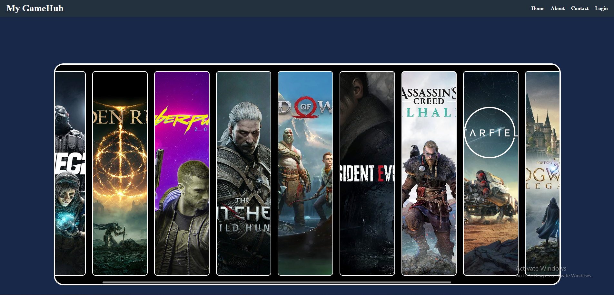
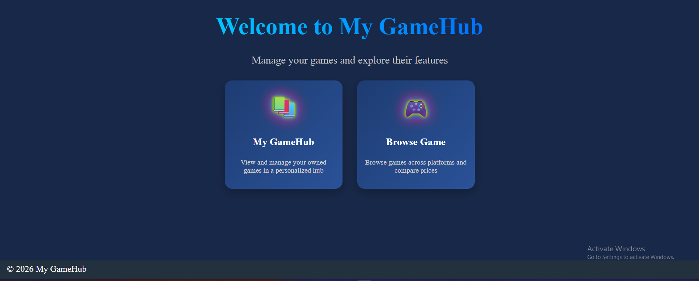
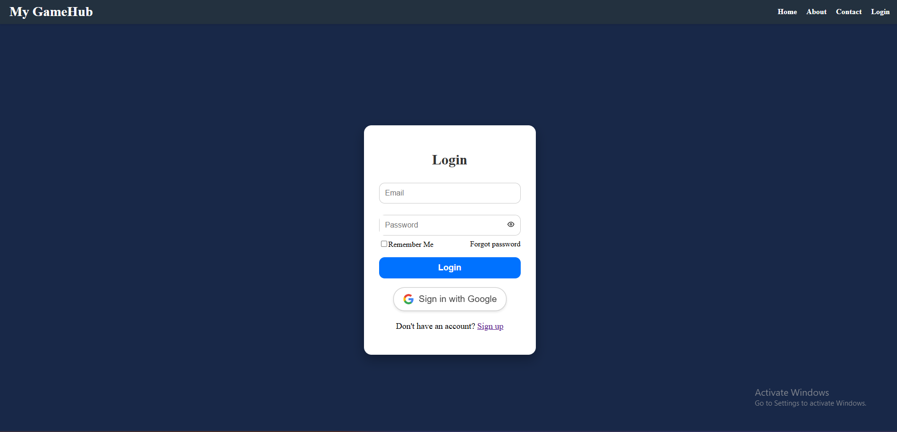
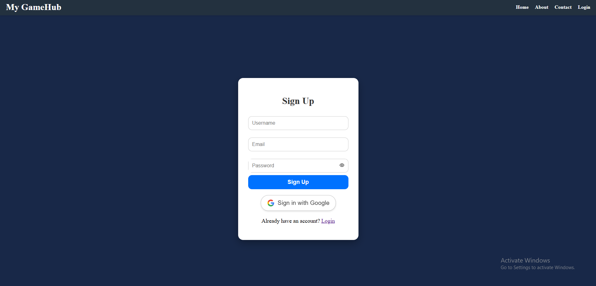
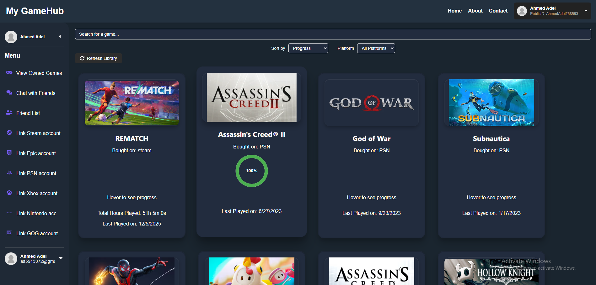
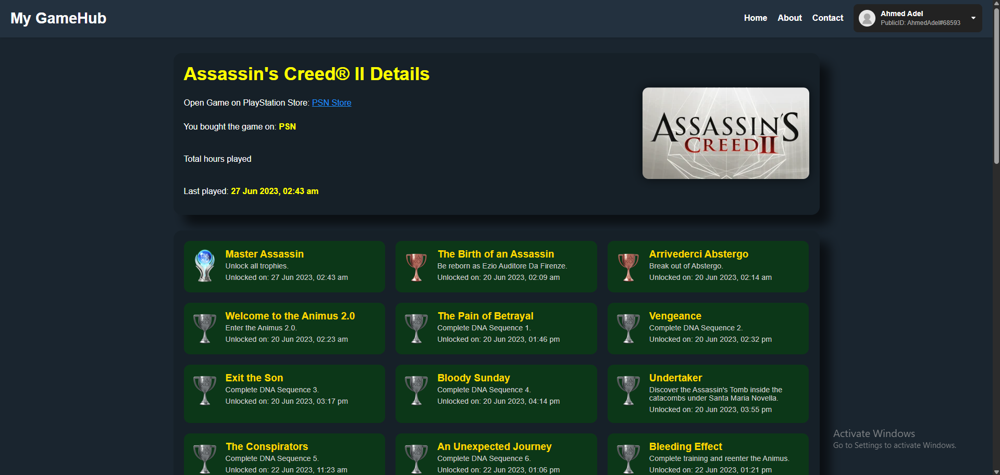
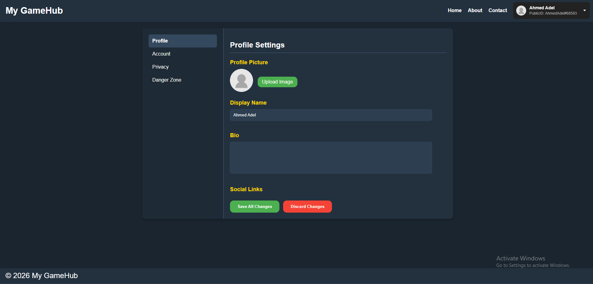
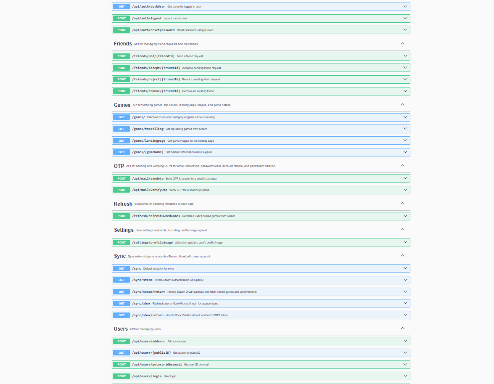

# Cross‑Platform GameHub Price Aggregator

> ⚠️ **Private Project – Do Not Copy or Use**  
> This repository is for personal use and documentation purposes only.  
> Unauthorized copying, distribution, or usage of the code is prohibited.

## 📌 Project Overview

The Cross‑Platform GameHub Price Aggregator is a full-stack web application that compares game prices across multiple digital storefronts (Steam, Epic Games Store, PlayStation Store, Xbox Store).  
It provides a seamless user experience for searching, filtering, and tracking game prices, managing owned games, and connecting with friends to share gaming insights.

---

## 🛠️ Features & Technical Highlights

- **Landing Page & Pages Overview:**  
  - Landing page with featured games and platform filters.  
  - Game search & dynamic filtering.  
  - Owned Games page for tracking purchased games.  
  - Friends page for connecting with friends and sharing game insights.  

- **Authentication:**  
  - Google OAuth 2.0 login integration for secure authentication.  
  - Session management using JWT tokens.  

- **Multi-Platform Price Aggregation:**  
  - Asynchronous API requests to fetch prices from multiple stores.  
  - Normalized data schema for consistent front-end display.  

- **Backend Architecture:**  
  - Node.js with Express.js for RESTful API endpoints.  
  - MongoDB for storing game metadata, user profiles, friends, and owned games.  
  - Redis caching for frequently requested games to improve performance.  
  - Swagger documentation for all API endpoints).  

- **Frontend Architecture:**  
  - React (Vite) with component-based design.  
  - Responsive UI using modern React hooks and state management.  
  - Real-time updates for owned games and friends activities.  

- **Deployment & DevOps:**  
  - Containerized with Docker for development and production parity.  
  - CI/CD via GitHub Actions for automated testing and deployment.  
  - Hosted on AWS EC2 with S3 for static assets and RDS backups.  

- **Security & Privacy:**  
  - Environment variables used for API keys, OAuth credentials, and database access.  
  - All endpoints private; project is intended for personal portfolio use.  

---

## 💡 Tech Stack

| Layer          | Technology |
|----------------|------------|
| Frontend       | React (Vite), JavaScript, CSS3 |
| Backend        | Node.js, Express.js |
| Database       | MongoDB, Redis |
| Auth           | Google OAuth 2.0, JWT |
| DevOps         | Docker, GitHub Actions, AWS EC2, S3, RDS |
| Architecture   | RESTful APIs, Component-based UI, Caching Layer |
| Documentation  | Swagger (API) |

---

## 🖼️ Screenshots / Demo

> **Note:** Screenshots are for demonstration only. Project is private.

### Landing Page

### Login & Signup

### Owned Games Page

### Achievment Page

### Settings Page

---

## 📄 API Documentation

All API endpoints are documented with Swagger.  
Access the full documentation (private use only):  
`/swagger` or hosted Swagger UI in the deployed environment.

> ⚠️ **Reminder:** This project is private. All code, APIs, and deployment scripts are proprietary and intended for personal documentation and portfolio demonstration only.
